# Esquema de la Base de Datos: NurseHub

**Versión:** 1.0
**Fecha:** 2025-10-07
**Motor:** MySQL 8.0+
**Charset:** utf8mb4_unicode_ci

Este documento define la arquitectura completa de la base de datos de NurseHub, organizada por módulos funcionales. Cada tabla está documentada con su propósito, campos, relaciones e índices.

---

## Diagrama de Relaciones (ERD)

```mermaid
erDiagram
    %% MÓDULO 0: Configuración Hospitalaria
    areas ||--o{ pisos : "tiene"
    pisos ||--o{ cuartos : "tiene"
    cuartos ||--o{ camas : "tiene"
    camas ||--o{ ingresos : "ocupa"

    %% MÓDULO 1: Registro Clínico Electrónico
    pacientes ||--o{ ingresos : "tiene"
    ingresos ||--o{ signos_vitales : "registra"
    ingresos ||--o{ balances_liquidos : "registra"
    ingresos ||--o{ escalas_valoracion : "tiene"
    ingresos ||--o{ diagnosticos_enfermeria : "tiene"
    ingresos ||--o{ planes_cuidado : "tiene"
    tipos_escala ||--o{ escalas_valoracion : "usa"

    %% MÓDULO 2: Gestión de Personal
    users ||--|| enfermeros : "es"
    enfermeros ||--o{ enfermero_habilidad : "tiene"
    habilidades ||--o{ enfermero_habilidad : "pertenece"
    enfermeros ||--o{ rotaciones : "registra"
    areas ||--o{ rotaciones : "recibe"
    enfermeros ||--o{ asignaciones : "atiende"

    %% MÓDULO 3: Asignación y Turnos
    turnos ||--o{ asignaciones : "organiza"
    ingresos ||--o{ asignaciones : "asignado_a"
    enfermeros ||--o{ asignaciones : "asignado_a"
    turnos ||--o{ relevos_turno : "genera"
    enfermeros ||--o{ relevos_turno_entrega : "entrega"
    enfermeros ||--o{ relevos_turno_recibe : "recibe"

    %% MÓDULO 4: Farmacia e Insumos
    farmacos ||--o{ skus : "tiene"
    skus ||--o{ lotes : "tiene"
    lotes ||--o{ movimientos_inventario : "afecta"
    ingresos ||--o{ prescripciones : "tiene"
    farmacos ||--o{ prescripciones : "prescribe"
    prescripciones ||--o{ suministros_medicamento : "suministra"
    enfermeros ||--o{ suministros_medicamento : "administra"
    lotes ||--o{ suministros_medicamento : "usa"

    %% MÓDULO 5: Capacitación
    actividades_capacitacion ||--o{ inscripciones_capacitacion : "tiene"
    enfermeros ||--o{ inscripciones_capacitacion : "inscribe"
    inscripciones_capacitacion ||--o{ asistencias_capacitacion : "registra"
    inscripciones_capacitacion ||--o{ certificaciones : "genera"
    enfermeros ||--o{ certificaciones : "obtiene"

    %% Tablas principales con campos

    users {
        bigint id PK
        string name
        string email UK
        timestamp email_verified_at
        string password
        enum role "admin, coordinador, jefe_piso, enfermero, jefe_capacitacion"
        boolean is_active
        timestamp created_at
        timestamp updated_at
    }

    pacientes {
        bigint id PK
        string numero_expediente UK
        string qr_code UK
        string nombre_completo
        date fecha_nacimiento
        enum sexo "M, F, Otro"
        string curp UK
        string telefono
        string contacto_emergencia_nombre
        string contacto_emergencia_telefono
        text alergias
        text antecedentes_medicos
        timestamp created_at
        timestamp updated_at
    }

    areas {
        bigint id PK
        string nombre UK
        string codigo UK
        text descripcion
        boolean opera_24_7
        decimal ratio_enfermero_paciente
        boolean requiere_certificacion
        timestamp created_at
        timestamp updated_at
    }

    pisos {
        bigint id PK
        bigint area_id FK
        string nombre
        int numero_piso
        string especialidad
        timestamp created_at
        timestamp updated_at
    }

    cuartos {
        bigint id PK
        bigint piso_id FK
        string numero_cuarto
        enum tipo "individual, doble, multiple"
        timestamp created_at
        timestamp updated_at
    }

    camas {
        bigint id PK
        bigint cuarto_id FK
        string numero_cama
        enum estado "libre, ocupada, en_limpieza, en_mantenimiento"
        timestamp created_at
        timestamp updated_at
    }

    ingresos {
        bigint id PK
        bigint paciente_id FK
        bigint cama_id FK
        string numero_ingreso UK
        datetime fecha_ingreso
        datetime fecha_alta
        string motivo_ingreso
        enum nivel_triage "rojo, naranja, amarillo, verde, azul"
        int score_triage
        enum estado "activo, alta, transferido, fallecido"
        text observaciones_ingreso
        text observaciones_alta
        timestamp created_at
        timestamp updated_at
    }

    signos_vitales {
        bigint id PK
        bigint ingreso_id FK
        bigint enfermero_id FK
        datetime fecha_hora
        decimal presion_sistolica
        decimal presion_diastolica
        int frecuencia_cardiaca
        int frecuencia_respiratoria
        decimal temperatura
        int saturacion_oxigeno
        decimal glucosa
        text observaciones
        timestamp created_at
        timestamp updated_at
    }

    balances_liquidos {
        bigint id PK
        bigint ingreso_id FK
        bigint enfermero_id FK
        datetime fecha_hora
        enum tipo "ingesta, orina, evacuacion, otros"
        decimal cantidad_ml
        text descripcion
        timestamp created_at
        timestamp updated_at
    }

    tipos_escala {
        bigint id PK
        string nombre UK
        string codigo UK
        text descripcion
        int valor_minimo
        int valor_maximo
        json interpretacion
        timestamp created_at
        timestamp updated_at
    }

    escalas_valoracion {
        bigint id PK
        bigint ingreso_id FK
        bigint tipo_escala_id FK
        bigint enfermero_id FK
        datetime fecha_hora
        int puntuacion
        text observaciones
        timestamp created_at
        timestamp updated_at
    }

    diagnosticos_enfermeria {
        bigint id PK
        bigint ingreso_id FK
        bigint enfermero_id FK
        text diagnostico
        datetime fecha_diagnostico
        enum prioridad "alta, media, baja"
        boolean resuelto
        datetime fecha_resolucion
        timestamp created_at
        timestamp updated_at
    }

    planes_cuidado {
        bigint id PK
        bigint diagnostico_id FK
        text objetivo
        text intervenciones
        datetime fecha_inicio
        datetime fecha_fin
        enum estado "activo, completado, suspendido"
        timestamp created_at
        timestamp updated_at
    }

    enfermeros {
        bigint id PK
        bigint user_id FK "UK - Unique"
        string cedula_profesional UK
        enum tipo_asignacion "fijo, rotativo"
        bigint area_fija_id FK
        text especialidades
        int anos_experiencia
        timestamp created_at
        timestamp updated_at
    }

    habilidades {
        bigint id PK
        string nombre UK
        string codigo UK
        text descripcion
        boolean requiere_certificacion
        timestamp created_at
        timestamp updated_at
    }

    enfermero_habilidad {
        bigint id PK
        bigint enfermero_id FK
        bigint habilidad_id FK
        date fecha_obtencion
        date fecha_expiracion
        string numero_certificado
        timestamp created_at
        timestamp updated_at
    }

    rotaciones {
        bigint id PK
        bigint enfermero_id FK
        bigint area_id FK
        date fecha_inicio
        date fecha_fin
        text motivo
        timestamp created_at
        timestamp updated_at
    }

    turnos {
        bigint id PK
        bigint area_id FK
        date fecha
        enum tipo "matutino, nocturno"
        time hora_inicio
        time hora_fin
        bigint jefe_turno_id FK
        timestamp created_at
        timestamp updated_at
    }

    asignaciones {
        bigint id PK
        bigint turno_id FK
        bigint enfermero_id FK
        bigint ingreso_id FK
        datetime fecha_hora_asignacion
        datetime fecha_hora_liberacion
        enum estado "activa, completada, reasignada"
        text observaciones
        timestamp created_at
        timestamp updated_at
    }

    relevos_turno {
        bigint id PK
        bigint turno_saliente_id FK
        bigint turno_entrante_id FK
        bigint enfermero_entrega_id FK
        bigint enfermero_recibe_id FK
        datetime fecha_hora_relevo
        text novedades_generales
        text pendientes
        string firma_digital_entrega
        string firma_digital_recibe
        timestamp created_at
        timestamp updated_at
    }

    farmacos {
        bigint id PK
        string nombre_generico UK
        string nombre_comercial
        string principio_activo
        enum categoria "analgesico, antibiotico, antihipertensivo, otro"
        text indicaciones
        text contraindicaciones
        boolean requiere_receta
        timestamp created_at
        timestamp updated_at
    }

    skus {
        bigint id PK
        bigint farmaco_id FK
        string codigo_sku UK
        string qr_code UK
        string presentacion
        string dosis
        string via_administracion
        int cantidad_unidades
        decimal precio_unitario
        timestamp created_at
        timestamp updated_at
    }

    lotes {
        bigint id PK
        bigint sku_id FK
        string numero_lote UK
        date fecha_fabricacion
        date fecha_caducidad
        int stock_actual
        int stock_minimo
        int stock_maximo
        string ubicacion_almacen
        timestamp created_at
        timestamp updated_at
    }

    movimientos_inventario {
        bigint id PK
        bigint lote_id FK
        bigint usuario_id FK
        enum tipo_movimiento "entrada, salida, ajuste, merma"
        int cantidad
        int stock_anterior
        int stock_nuevo
        text motivo
        datetime fecha_hora
        timestamp created_at
        timestamp updated_at
    }

    prescripciones {
        bigint id PK
        bigint ingreso_id FK
        bigint farmaco_id FK
        bigint medico_id FK
        string dosis
        string frecuencia
        string via_administracion
        datetime fecha_inicio
        datetime fecha_fin
        enum estado "activa, suspendida, completada"
        text indicaciones_especiales
        timestamp created_at
        timestamp updated_at
    }

    suministros_medicamento {
        bigint id PK
        bigint prescripcion_id FK
        bigint lote_id FK
        bigint enfermero_id FK
        datetime fecha_hora_suministro
        int cantidad_suministrada
        text observaciones
        boolean validacion_qr
        timestamp created_at
        timestamp updated_at
    }

    actividades_capacitacion {
        bigint id PK
        string titulo
        enum tipo "curso, beca, campana, platica"
        text descripcion
        datetime fecha_inicio
        datetime fecha_fin
        json horarios_sesiones
        int capacidad_maxima
        int horas_otorgadas
        decimal porcentaje_asistencia_minima
        bigint responsable_id FK
        enum estado "abierta, en_curso, finalizada, cancelada"
        timestamp created_at
        timestamp updated_at
    }

    inscripciones_capacitacion {
        bigint id PK
        bigint actividad_id FK
        bigint enfermero_id FK
        datetime fecha_inscripcion
        enum tipo_inscripcion "autoservicio, asignacion_manual"
        bigint inscrito_por_id FK
        enum estado "inscrito, aprobado, reprobado, cancelado"
        timestamp created_at
        timestamp updated_at
    }

    asistencias_capacitacion {
        bigint id PK
        bigint inscripcion_id FK
        date fecha_sesion
        time hora_inicio
        time hora_fin
        boolean asistio
        text observaciones
        bigint registrado_por_id FK
        timestamp created_at
        timestamp updated_at
    }

    certificaciones {
        bigint id PK
        bigint enfermero_id FK
        bigint inscripcion_id FK
        string nombre_certificacion
        string numero_certificado UK
        date fecha_emision
        date fecha_expiracion
        decimal calificacion
        string archivo_pdf
        timestamp created_at
        timestamp updated_at
    }
```



---

## Descripción de Tablas por Módulo

### MÓDULO 0: Configuración Hospitalaria

#### `areas`
**Propósito:** Define las áreas operativas del hospital (Urgencias, UCI, Cirugía, etc.)

**Campos importantes:**
- `nombre`: Nombre del área (ej: "Urgencias", "Terapia Intensiva")
- `codigo`: Código único para identificación rápida (ej: "URG", "UCI")
- `opera_24_7`: Boolean que indica si el área opera sin interrupción
- `ratio_enfermero_paciente`: Ratio recomendado (ej: 1:4 en hospitalización, 1:2 en UCI)
- `requiere_certificacion`: Si se requiere certificación especial para trabajar en esta área

**Relaciones:**
- 1 área tiene N pisos (1:N con `pisos`)
- 1 área tiene N rotaciones de enfermeros (1:N con `rotaciones`)

---

#### `pisos`
**Propósito:** Representa los niveles físicos dentro de cada área del hospital

**Campos importantes:**
- `area_id`: Área a la que pertenece el piso
- `numero_piso`: Número del piso (1, 2, 3...)
- `especialidad`: Especialidad médica del piso (ej: "Pediatría", "Ginecología")

**Relaciones:**
- N pisos pertenecen a 1 área (N:1 con `areas`)
- 1 piso tiene N cuartos (1:N con `cuartos`)

---

#### `cuartos`
**Propósito:** Habitaciones dentro de cada piso

**Campos importantes:**
- `piso_id`: Piso al que pertenece
- `numero_cuarto`: Número identificador del cuarto
- `tipo`: Tipo de cuarto (individual, doble, múltiple)

**Relaciones:**
- N cuartos pertenecen a 1 piso (N:1 con `pisos`)
- 1 cuarto tiene N camas (1:N con `camas`)

---

#### `camas`
**Propósito:** Camas individuales donde se hospedan los pacientes

**Campos importantes:**
- `cuarto_id`: Cuarto al que pertenece
- `numero_cama`: Identificador de la cama (A, B, C o 1, 2, 3)
- `estado`: Estado actual (libre, ocupada, en_limpieza, en_mantenimiento)

**Relaciones:**
- N camas pertenecen a 1 cuarto (N:1 con `cuartos`)
- 1 cama tiene N ingresos históricos (1:N con `ingresos`)

---

### MÓDULO 1: Registro Clínico Electrónico

#### `pacientes`
**Propósito:** Información demográfica y clínica base de cada paciente

**Campos importantes:**
- `numero_expediente`: Identificador único del paciente en el hospital
- `qr_code`: Código QR único para escaneo rápido (se genera al crear paciente)
- `curp`: CURP del paciente (único en México)
- `alergias`: JSON o TEXT con lista de alergias conocidas
- `antecedentes_medicos`: Historial clínico relevante

**Relaciones:**
- 1 paciente tiene N ingresos históricos (1:N con `ingresos`)

---

#### `ingresos`
**Propósito:** Representa cada ingreso hospitalario de un paciente (una visita al hospital)

**Campos importantes:**
- `paciente_id`: Paciente que ingresa
- `cama_id`: Cama asignada
- `numero_ingreso`: Folio único del ingreso
- `nivel_triage`: Nivel asignado en urgencias (rojo, naranja, amarillo, verde, azul)
- `score_triage`: Puntuación numérica del TRIAGE (para ordenamiento)
- `estado`: Estado actual del ingreso (activo, alta, transferido, fallecido)

**Relaciones:**
- N ingresos pertenecen a 1 paciente (N:1 con `pacientes`)
- 1 ingreso ocupa 1 cama (N:1 con `camas`)
- 1 ingreso tiene N registros de signos vitales (1:N con `signos_vitales`)
- 1 ingreso tiene N balances de líquidos (1:N con `balances_liquidos`)
- 1 ingreso tiene N escalas de valoración (1:N con `escalas_valoracion`)
- 1 ingreso tiene N diagnósticos de enfermería (1:N con `diagnosticos_enfermeria`)
- 1 ingreso tiene N prescripciones (1:N con `prescripciones`)
- 1 ingreso tiene N asignaciones de enfermeros (1:N con `asignaciones`)

---

#### `signos_vitales`
**Propósito:** Registro cronológico de signos vitales del paciente

**Campos importantes:**
- `ingreso_id`: Ingreso al que pertenece el registro
- `enfermero_id`: Enfermero que tomó los signos vitales
- `fecha_hora`: Timestamp del registro
- `presion_sistolica` / `presion_diastolica`: Presión arterial
- `frecuencia_cardiaca`: Latidos por minuto
- `frecuencia_respiratoria`: Respiraciones por minuto
- `temperatura`: En grados Celsius
- `saturacion_oxigeno`: SpO2 en porcentaje
- `glucosa`: Nivel de glucosa en mg/dL

**Relaciones:**
- N signos vitales pertenecen a 1 ingreso (N:1 con `ingresos`)
- N signos vitales son registrados por 1 enfermero (N:1 con `enfermeros`)

---

#### `balances_liquidos`
**Propósito:** Control de ingestas y egresos de líquidos del paciente

**Campos importantes:**
- `ingreso_id`: Ingreso al que pertenece
- `tipo`: Tipo de balance (ingesta, orina, evacuación, otros)
- `cantidad_ml`: Cantidad en mililitros
- `descripcion`: Detalles adicionales

**Relaciones:**
- N balances pertenecen a 1 ingreso (N:1 con `ingresos`)
- N balances son registrados por 1 enfermero (N:1 con `enfermeros`)

---

#### `tipos_escala`
**Propósito:** Catálogo de escalas de valoración disponibles (EVA, Braden, Norton, etc.)

**Campos importantes:**
- `nombre`: Nombre de la escala (ej: "Escala de Braden")
- `codigo`: Código único (ej: "BRADEN", "EVA")
- `valor_minimo` / `valor_maximo`: Rango de puntuación
- `interpretacion`: JSON con interpretación de rangos (ej: {"0-12": "Alto riesgo", "13-18": "Riesgo moderado"})

**Relaciones:**
- 1 tipo de escala tiene N valoraciones (1:N con `escalas_valoracion`)

---

#### `escalas_valoracion`
**Propósito:** Registros de valoraciones aplicadas al paciente

**Campos importantes:**
- `ingreso_id`: Ingreso valorado
- `tipo_escala_id`: Tipo de escala aplicada
- `enfermero_id`: Enfermero que realizó la valoración
- `puntuacion`: Puntuación obtenida
- `observaciones`: Detalles adicionales

**Relaciones:**
- N valoraciones pertenecen a 1 ingreso (N:1 con `ingresos`)
- N valoraciones usan 1 tipo de escala (N:1 con `tipos_escala`)

---

#### `diagnosticos_enfermeria`
**Propósito:** Diagnósticos de enfermería identificados para el paciente

**Campos importantes:**
- `ingreso_id`: Ingreso diagnosticado
- `diagnostico`: Texto del diagnóstico (ej: "Riesgo de caídas relacionado con...")
- `prioridad`: Nivel de prioridad (alta, media, baja)
- `resuelto`: Boolean que indica si ya fue resuelto
- `fecha_resolucion`: Fecha en que se resolvió

**Relaciones:**
- N diagnósticos pertenecen a 1 ingreso (N:1 con `ingresos`)
- 1 diagnóstico tiene N planes de cuidado (1:N con `planes_cuidado`)

---

#### `planes_cuidado`
**Propósito:** Planes de intervención para cada diagnóstico de enfermería

**Campos importantes:**
- `diagnostico_id`: Diagnóstico al que responde
- `objetivo`: Objetivo del plan (ej: "Prevenir caídas durante la hospitalización")
- `intervenciones`: Acciones a realizar (ej: "Barandales arriba, vigilancia cada 2h")
- `estado`: Estado del plan (activo, completado, suspendido)

**Relaciones:**
- N planes pertenecen a 1 diagnóstico (N:1 con `diagnosticos_enfermeria`)

---

### MÓDULO 2: Gestión de Personal de Enfermería

#### `users`
**Propósito:** Tabla de autenticación (viene de Laravel Breeze)

**Campos importantes:**
- `role`: Rol del usuario (admin, coordinador, jefe_piso, enfermero, jefe_capacitacion)
- `is_active`: Si el usuario está activo

**Relaciones:**
- 1 user es 1 enfermero (1:1 con `enfermeros` si role=enfermero)

---

#### `enfermeros`
**Propósito:** Perfil profesional extendido del personal de enfermería

**Campos importantes:**
- `user_id`: Usuario del sistema (relación 1:1)
- `cedula_profesional`: Cédula profesional única
- `tipo_asignacion`: Si es fijo a un área o rotativo
- `area_fija_id`: Si es fijo, área asignada
- `especialidades`: Texto con especialidades del enfermero
- `anos_experiencia`: Años de experiencia profesional

**Relaciones:**
- 1 enfermero es 1 user (1:1 con `users`)
- 1 enfermero tiene N habilidades (N:N con `habilidades` a través de `enfermero_habilidad`)
- 1 enfermero tiene N rotaciones (1:N con `rotaciones`)
- 1 enfermero tiene N asignaciones (1:N con `asignaciones`)
- 1 enfermero tiene N inscripciones a capacitaciones (1:N con `inscripciones_capacitacion`)

---

#### `habilidades`
**Propósito:** Catálogo de habilidades/certificaciones que puede tener un enfermero

**Campos importantes:**
- `nombre`: Nombre de la habilidad (ej: "Manejo de Paciente Pediátrico")
- `codigo`: Código único (ej: "PED", "UCI")
- `requiere_certificacion`: Si requiere certificación oficial

**Relaciones:**
- 1 habilidad es tenida por N enfermeros (N:N con `enfermeros` a través de `enfermero_habilidad`)

---

#### `enfermero_habilidad`
**Propósito:** Tabla pivote que relaciona enfermeros con sus habilidades/certificaciones

**Campos importantes:**
- `fecha_obtencion`: Cuándo obtuvo la habilidad
- `fecha_expiracion`: Cuándo expira (null si no expira)
- `numero_certificado`: Número del certificado oficial

**Relaciones:**
- N registros conectan enfermeros y habilidades (N:N entre `enfermeros` y `habilidades`)

---

#### `rotaciones`
**Propósito:** Historial de rotaciones de enfermeros entre áreas

**Campos importantes:**
- `enfermero_id`: Enfermero que rota
- `area_id`: Área a la que rota
- `fecha_inicio` / `fecha_fin`: Período de rotación
- `motivo`: Razón de la rotación

**Relaciones:**
- N rotaciones pertenecen a 1 enfermero (N:1 con `enfermeros`)
- N rotaciones son hacia 1 área (N:1 con `areas`)

---

### MÓDULO 3: Asignación de Pacientes y Turnos

#### `turnos`
**Propósito:** Define los turnos de trabajo por área y fecha

**Campos importantes:**
- `area_id`: Área donde opera el turno
- `fecha`: Fecha del turno
- `tipo`: Matutino (8-19) o Nocturno (19-8)
- `hora_inicio` / `hora_fin`: Horarios específicos
- `jefe_turno_id`: Jefe de piso/área responsable del turno

**Relaciones:**
- 1 turno pertenece a 1 área (N:1 con `areas`)
- 1 turno tiene N asignaciones de enfermeros a pacientes (1:N con `asignaciones`)
- 1 turno tiene N relevos (1:N con `relevos_turno`)

---

#### `asignaciones`
**Propósito:** Asignación específica de un enfermero a un paciente en un turno

**Campos importantes:**
- `turno_id`: Turno en el que se asigna
- `enfermero_id`: Enfermero asignado
- `ingreso_id`: Paciente (ingreso) asignado
- `fecha_hora_asignacion`: Cuándo se asignó
- `fecha_hora_liberacion`: Cuándo terminó la asignación
- `estado`: Estado (activa, completada, reasignada)

**Relaciones:**
- N asignaciones pertenecen a 1 turno (N:1 con `turnos`)
- N asignaciones son de 1 enfermero (N:1 con `enfermeros`)
- N asignaciones son para 1 ingreso (N:1 con `ingresos`)

---

#### `relevos_turno`
**Propósito:** Registro del relevo entre turnos (handoff)

**Campos importantes:**
- `turno_saliente_id` / `turno_entrante_id`: Turnos que se relevan
- `enfermero_entrega_id` / `enfermero_recibe_id`: Enfermeros del relevo
- `novedades_generales`: Novedades del turno
- `pendientes`: Tareas pendientes para el siguiente turno
- `firma_digital_entrega` / `firma_digital_recibe`: Firmas digitales para validación

**Relaciones:**
- 1 relevo conecta 2 turnos (N:1 con `turnos` dos veces)
- 1 relevo involucra 2 enfermeros (N:1 con `enfermeros` dos veces)

---

### MÓDULO 4: Farmacia e Insumos

#### `farmacos`
**Propósito:** Catálogo de medicamentos genéricos

**Campos importantes:**
- `nombre_generico`: Nombre genérico del fármaco (ej: "Paracetamol")
- `nombre_comercial`: Nombre comercial (ej: "Tylenol")
- `principio_activo`: Sustancia activa
- `categoria`: Categoría terapéutica
- `requiere_receta`: Si requiere prescripción médica

**Relaciones:**
- 1 fármaco tiene N SKUs (presentaciones) (1:N con `skus`)
- 1 fármaco tiene N prescripciones (1:N con `prescripciones`)

---

#### `skus`
**Propósito:** Presentaciones específicas de cada fármaco (Stock Keeping Units)

**Campos importantes:**
- `farmaco_id`: Fármaco del que deriva
- `codigo_sku`: Código único de la presentación (ej: "PARA-500-20")
- `qr_code`: Código QR único para escaneo
- `presentacion`: Descripción (ej: "Caja 20 tabletas")
- `dosis`: Dosis por unidad (ej: "500mg")
- `via_administracion`: Oral, IV, IM, etc.
- `cantidad_unidades`: Unidades por paquete/caja

**Relaciones:**
- N SKUs pertenecen a 1 fármaco (N:1 con `farmacos`)
- 1 SKU tiene N lotes (1:N con `lotes`)

---

#### `lotes`
**Propósito:** Lotes específicos de cada SKU (para trazabilidad)

**Campos importantes:**
- `sku_id`: SKU al que pertenece
- `numero_lote`: Número de lote del fabricante
- `fecha_fabricacion` / `fecha_caducidad`: Fechas críticas
- `stock_actual`: Cantidad disponible en tiempo real
- `stock_minimo` / `stock_maximo`: Límites para alertas
- `ubicacion_almacen`: Ubicación física en almacén

**Relaciones:**
- N lotes pertenecen a 1 SKU (N:1 con `skus`)
- 1 lote tiene N movimientos de inventario (1:N con `movimientos_inventario`)
- 1 lote tiene N suministros a pacientes (1:N con `suministros_medicamento`)

---

#### `movimientos_inventario`
**Propósito:** Auditoría de todos los movimientos de stock

**Campos importantes:**
- `lote_id`: Lote afectado
- `usuario_id`: Usuario que realizó el movimiento
- `tipo_movimiento`: entrada, salida, ajuste, merma
- `cantidad`: Cantidad del movimiento
- `stock_anterior` / `stock_nuevo`: Stock antes y después

**Relaciones:**
- N movimientos afectan a 1 lote (N:1 con `lotes`)
- N movimientos son realizados por 1 usuario (N:1 con `users`)

---

#### `prescripciones`
**Propósito:** Prescripciones médicas para pacientes

**Campos importantes:**
- `ingreso_id`: Paciente al que se prescribe
- `farmaco_id`: Medicamento prescrito
- `medico_id`: Médico que prescribe (FK a `users` con role=médico)
- `dosis` / `frecuencia` / `via_administracion`: Indicaciones
- `estado`: activa, suspendida, completada

**Relaciones:**
- N prescripciones pertenecen a 1 ingreso (N:1 con `ingresos`)
- N prescripciones son de 1 fármaco (N:1 con `farmacos`)
- 1 prescripción tiene N suministros (1:N con `suministros_medicamento`)

---

#### `suministros_medicamento`
**Propósito:** Registro de cada suministro real de medicamento al paciente

**Campos importantes:**
- `prescripcion_id`: Prescripción que se cumple
- `lote_id`: Lote específico usado
- `enfermero_id`: Enfermero que suministra
- `fecha_hora_suministro`: Timestamp del suministro
- `cantidad_suministrada`: Cantidad dada
- `validacion_qr`: Si se validó escaneando QR del medicamento y pulsera del paciente

**Relaciones:**
- N suministros cumplen 1 prescripción (N:1 con `prescripciones`)
- N suministros usan 1 lote (N:1 con `lotes`)
- N suministros son realizados por 1 enfermero (N:1 con `enfermeros`)

---

### MÓDULO 5: Capacitación y Desarrollo

#### `actividades_capacitacion`
**Propósito:** Catálogo de actividades de capacitación (cursos, becas, campañas)

**Campos importantes:**
- `titulo`: Nombre de la actividad
- `tipo`: curso, beca, campaña, plática
- `fecha_inicio` / `fecha_fin`: Período de la actividad
- `horarios_sesiones`: JSON con horarios de cada sesión (ej: [{"dia": "2025-10-10", "inicio": "09:00", "fin": "13:00"}])
- `capacidad_maxima`: Cupo máximo de participantes
- `horas_otorgadas`: Horas de capacitación que otorga
- `porcentaje_asistencia_minima`: % mínimo para aprobar (ej: 80)
- `responsable_id`: Jefe de Capacitación responsable
- `estado`: abierta, en_curso, finalizada, cancelada

**Relaciones:**
- 1 actividad tiene N inscripciones (1:N con `inscripciones_capacitacion`)

---

#### `inscripciones_capacitacion`
**Propósito:** Inscripciones de enfermeros a actividades de capacitación

**Campos importantes:**
- `actividad_id`: Actividad a la que se inscribe
- `enfermero_id`: Enfermero inscrito
- `tipo_inscripcion`: autoservicio (el enfermero se inscribió) o asignacion_manual (Patch Addams lo inscribió)
- `inscrito_por_id`: Usuario que realizó la inscripción (puede ser el mismo enfermero o Patch Addams)
- `estado`: inscrito, aprobado, reprobado, cancelado

**Relaciones:**
- N inscripciones pertenecen a 1 actividad (N:1 con `actividades_capacitacion`)
- N inscripciones son de 1 enfermero (N:1 con `enfermeros`)
- 1 inscripción tiene N asistencias (1:N con `asistencias_capacitacion`)
- 1 inscripción puede generar 1 certificación (1:1 con `certificaciones`)

---

#### `asistencias_capacitacion`
**Propósito:** Registro de asistencia por sesión/día de cada capacitación

**Campos importantes:**
- `inscripcion_id`: Inscripción a la que pertenece
- `fecha_sesion`: Fecha de la sesión
- `hora_inicio` / `hora_fin`: Horario de la sesión
- `asistio`: Boolean (true/false)
- `registrado_por_id`: Usuario que registró la asistencia (normalmente Patch Addams)

**Relaciones:**
- N asistencias pertenecen a 1 inscripción (N:1 con `inscripciones_capacitacion`)

---

#### `certificaciones`
**Propósito:** Certificaciones obtenidas por completar capacitaciones

**Campos importantes:**
- `enfermero_id`: Enfermero que obtiene la certificación
- `inscripcion_id`: Inscripción que generó la certificación
- `nombre_certificacion`: Nombre del certificado
- `numero_certificado`: Folio único del certificado
- `fecha_emision` / `fecha_expiracion`: Vigencia
- `calificacion`: Calificación obtenida (si aplica)
- `archivo_pdf`: Ruta al PDF del certificado

**Relaciones:**
- N certificaciones pertenecen a 1 enfermero (N:1 con `enfermeros`)
- 1 certificación proviene de 1 inscripción (1:1 con `inscripciones_capacitacion`)

---

## Índices y Optimizaciones

### Índices Primarios (automáticos)
- Todas las tablas tienen `id` como PK con AUTO_INCREMENT

### Índices Únicos (UK)
- **users:** `email`
- **pacientes:** `numero_expediente`, `qr_code`, `curp`
- **areas:** `nombre`, `codigo`
- **camas:** Índice compuesto en `(cuarto_id, numero_cama)`
- **ingresos:** `numero_ingreso`
- **enfermeros:** `user_id`, `cedula_profesional`
- **habilidades:** `nombre`, `codigo`
- **tipos_escala:** `nombre`, `codigo`
- **farmacos:** `nombre_generico`
- **skus:** `codigo_sku`, `qr_code`
- **lotes:** `numero_lote`
- **certificaciones:** `numero_certificado`

### Índices para Búsquedas Frecuentes

**Tabla `ingresos`:**
- Índice en `paciente_id` (búsqueda de ingresos por paciente)
- Índice en `cama_id` (búsqueda de qué paciente está en una cama)
- Índice en `estado` (filtrar ingresos activos)
- Índice compuesto en `(estado, fecha_ingreso)` (dashboard de ingresos activos ordenados)

**Tabla `signos_vitales`:**
- Índice compuesto en `(ingreso_id, fecha_hora)` (gráficos de tendencias)
- Índice en `enfermero_id` (auditoría por enfermero)

**Tabla `asignaciones`:**
- Índice compuesto en `(turno_id, enfermero_id)` (asignaciones de un enfermero en un turno)
- Índice compuesto en `(turno_id, ingreso_id)` (quién atiende a un paciente en un turno)
- Índice en `estado` (filtrar asignaciones activas)

**Tabla `lotes`:**
- Índice en `sku_id` (buscar lotes de un SKU)
- Índice en `fecha_caducidad` (alertas de caducidad)
- Índice en `stock_actual` (alertas de stock bajo)

**Tabla `suministros_medicamento`:**
- Índice compuesto en `(prescripcion_id, fecha_hora_suministro)` (historial de suministros)
- Índice en `enfermero_id` (auditoría por enfermero)
- Índice en `lote_id` (trazabilidad por lote)

**Tabla `inscripciones_capacitacion`:**
- Índice compuesto en `(enfermero_id, actividad_id)` (evitar inscripciones duplicadas)
- Índice en `actividad_id` (listar inscritos de una capacitación)

**Tabla `turnos`:**
- Índice compuesto en `(area_id, fecha, tipo)` (búsqueda de turnos específicos)

---

## Validaciones Críticas de Negocio

### Validación de Disponibilidad de Enfermeros (Módulo 5 ↔ Módulo 3)

**Regla:** Un enfermero NO puede ser asignado a un turno si está inscrito en una capacitación con horarios que se solapen.

**Implementación:**
1. Al intentar crear una `asignacion`:
   - Obtener el turno (`turno.fecha`, `turno.hora_inicio`, `turno.hora_fin`)
   - Verificar en `inscripciones_capacitacion` si el enfermero tiene inscripciones activas
   - Revisar el campo JSON `actividades_capacitacion.horarios_sesiones`
   - Si hay solapamiento de horarios, **bloquear la asignación** y mostrar alerta

2. Al inscribir a un enfermero en una capacitación:
   - Verificar si tiene turnos asignados en las fechas/horarios de la capacitación
   - Si existe conflicto, **advertir** al usuario (Patch Addams o el enfermero)

**Consulta SQL de ejemplo:**
```sql
-- Verificar disponibilidad de enfermero para turno
SELECT COUNT(*) as conflictos
FROM inscripciones_capacitacion ic
JOIN actividades_capacitacion ac ON ic.actividad_id = ac.id
WHERE ic.enfermero_id = ?
  AND ic.estado IN ('inscrito', 'aprobado')
  AND ac.estado IN ('abierta', 'en_curso')
  AND ? BETWEEN ac.fecha_inicio AND ac.fecha_fin
  -- Validación adicional de horarios desde JSON
```

---

## Notas de Implementación

### Migraciones de Laravel
- **Orden de ejecución:** Las migraciones deben ejecutarse en el orden correcto para respetar las FKs
- **Cascadas:** Usar `onDelete('cascade')` en relaciones donde tiene sentido (ej: eliminar paciente → eliminar ingresos)
- **Restricciones:** Usar `onDelete('restrict')` en relaciones críticas (ej: no eliminar enfermero si tiene asignaciones activas)

### Soft Deletes
Las siguientes tablas usan `SoftDeletes` (Laravel):
- `users`
- `pacientes`
- `enfermeros`
- `actividades_capacitacion`
- `farmacos`, `skus`, `lotes`

**Razón:** Auditoría y recuperación de datos críticos

### Campos JSON
- **`tipos_escala.interpretacion`:** Estructura de ejemplo:
  ```json
  {
    "rangos": [
      {"min": 0, "max": 12, "interpretacion": "Alto riesgo"},
      {"min": 13, "max": 18, "interpretacion": "Riesgo moderado"},
      {"min": 19, "max": 23, "interpretacion": "Bajo riesgo"}
    ]
  }
  ```

- **`actividades_capacitacion.horarios_sesiones`:** Estructura de ejemplo:
  ```json
  [
    {"fecha": "2025-10-10", "hora_inicio": "09:00", "hora_fin": "13:00"},
    {"fecha": "2025-10-11", "hora_inicio": "09:00", "hora_fin": "13:00"},
    {"fecha": "2025-10-12", "hora_inicio": "09:00", "hora_fin": "13:00"}
  ]
  ```

### Timestamps
- **Todas las tablas** incluyen `created_at` y `updated_at` (convención de Laravel)
- Algunas tablas tienen timestamps específicos del negocio (ej: `fecha_hora_suministro`, `fecha_hora_relevo`)

### Generación de Códigos QR
- **Pacientes:** QR se genera al crear el paciente (antes de guardar)
- **SKUs:** QR se genera al crear el SKU
- **Formato:** Usar UUID v4 para garantizar unicidad

### Auditoría
Considerar agregar en v2.0:
- Tabla `audit_logs` para registrar cambios críticos
- Trigger en tablas sensibles (`suministros_medicamento`, `relevos_turno`, `asignaciones`)

---

## Restricciones de Integridad Referencial

### Cascadas Permitidas
- `ingresos` → `signos_vitales`, `balances_liquidos`, `escalas_valoracion` (CASCADE)
- `diagnosticos_enfermeria` → `planes_cuidado` (CASCADE)
- `actividades_capacitacion` → `inscripciones_capacitacion` (CASCADE)
- `inscripciones_capacitacion` → `asistencias_capacitacion` (CASCADE)

### Restricciones (NO permite eliminar)
- `pacientes` si tiene `ingresos` activos
- `enfermeros` si tiene `asignaciones` activas
- `lotes` si tiene `suministros_medicamento` (trazabilidad)
- `farmacos` si tiene `prescripciones` activas

---

## Historial de Cambios

**Versión 1.0 - 2025-10-07:**
- Diseño inicial completo del esquema de base de datos
- 40 tablas principales organizadas en 6 módulos
- Implementación de validación de disponibilidad de enfermeros
- Trazabilidad completa de medicamentos mediante QR
- Sistema de TRIAGE integrado
- Portal de capacitación con registro de asistencia

---

**Notas Finales:**

Este esquema está diseñado para ser implementado en MySQL 8.0+ con Laravel 12.

**Principios aplicados:**
- **Normalización:** Todas las tablas están normalizadas hasta 3FN
- **Trazabilidad:** Auditoría completa mediante timestamps y FKs
- **Escalabilidad:** Índices optimizados para queries frecuentes
- **Integridad:** Restricciones de FK garantizan consistencia de datos
- **Flexibilidad:** Uso de JSON para datos semi-estructurados (horarios, interpretaciones)

**Próximos pasos:**
1. Crear migraciones de Laravel en orden correcto
2. Implementar seeders para datos de prueba
3. Crear modelos Eloquent con relaciones
4. Implementar validaciones de negocio en capa de aplicación
